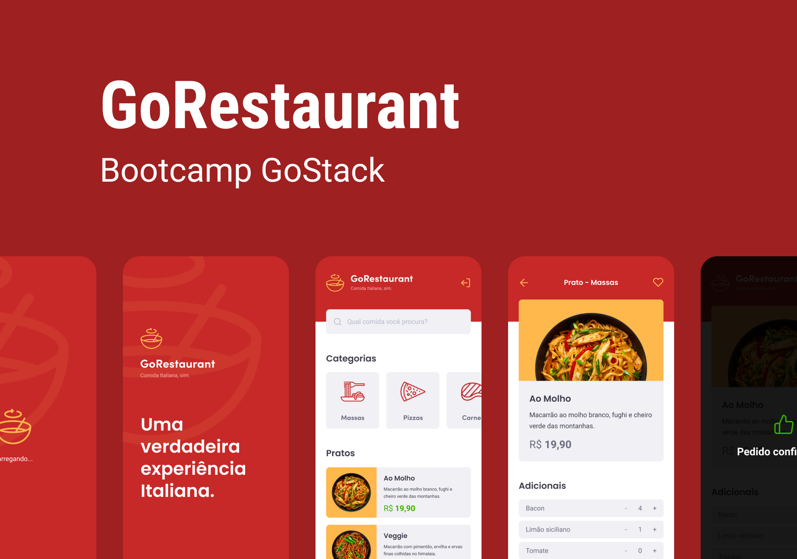

# GoRestaurant   

  

  

* [Content (en-US)](#secao-en_us)
* [Conteúdo (pt-BR)](#secao-pt_br)

## About the project 

GoRestaurant is a simple foods marketplace app, made as challenge from Rocketseat's GoStack bootcamp. The goal of this challenge was to implement features capable of list foods, search by name and category, favorite foods and create a order with given food and food extras.

## Content
  * [How to run the project](#installation)

## How to run the project 
To run the project, you'll need to have Node and NPM or Yarn installed to setup all the dependencies.

Install all dependencies using the `yarn` command, open a new terminal tab on project folder, and run `yarn json-server server.json -p 3333` to run the json server used as API. In order to open the app in android devices, run the following command to allow the device connection to the server: `adb reverse tcp:3333 tcp:3333`. After, open another terminal tab and run `yarn android` or `yarn ios` to run the application.

---

## Sobre o projeto 

GoRestaurant é um simples aplicativo de venda de comidas, feito como desafio do bootcamp GoStack da Rocketseat. O objetivo desse desafio era implementar funções capazes de listar comidas, filtrar por nome e categoria de comida, mostrar as comidas favoritas e criar um pedido com uma comida selecionada junto com seus adicionais.

## Conteúdos
  * [Como executar o projeto](#instalacao)

## Como executar o projeto 
Para executar o projeto, você irá precisar ter o Node e o NPM ou Yarn instalados para baixar as dependências.

Instale todas as dependencias utilizando o comando `yarn`, abra uma nova aba do terminal na pasta do projeto, e execute `yarn json-server server.json -p 3333` para rodar o servidor json usado como API. Para abrir o aplicativo em dispositivos android, execute o seguinte comando para permiter a conexão do dispositivo com o servidor: `adb reverse tcp:3333 tcp:3333`. Depois, abra outra aba do terminal e execute `yarn android` ou `yarn ios` para executar o aplicativo.

---
###### Developed on GoStack Bootcamp from [RocketSeat](https://rocketseat.com.br) :rocket:.
